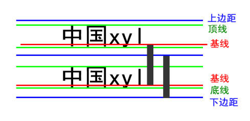

### 文本属性
·
```
div{
	font-size:16px;
	font-weight:700;
	font-family:微软雅黑;
	font-style:italic;
	line-height: 40px;
	/*文字属性连写*/
	font:  italic 700 16px/40px 微软雅黑;
}

```


文本属性有：大小、重量[这个似乎很少使用]，字体、样式、行高
最后一行是简写


Font-style: normal | italic;      normal 默认值  italic  斜体

font: font-style font-weight  font-size/line-height  font-family;
注意：font:后边写属性的值。一定按照书写顺序。
文本大小和字体是必写项。
Font:italic 700 16px/40px  微软雅黑;

> 字体使用UNcode编码
第一步：f12
第二步：找到console
第三步：输入escape(“宋体”)  注意英文的括号和双引号