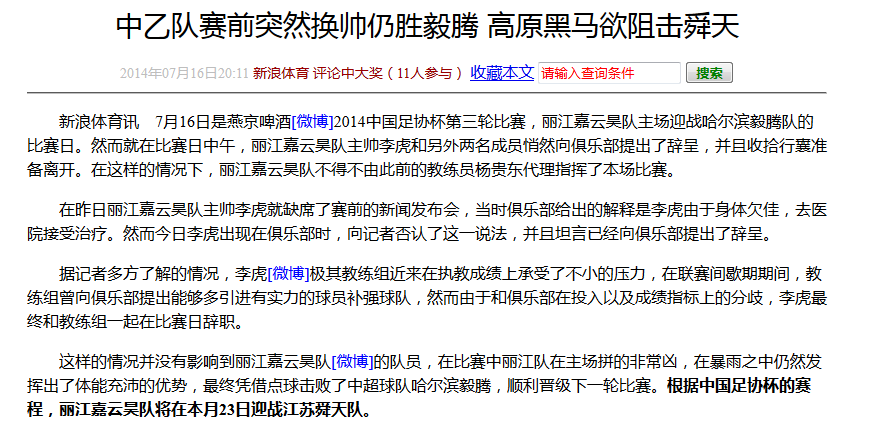

### 案例目标


### 分析
整体作为一个div.
最上面是一个div，作为标题
下来信息作为一个div
内容为一个div

> 步骤
	> 设置上面的宽度，然后将其margin:0 aotu;居中
	> 将标题居中显示，使用text-align:center; 
	> 标题的大小可以进行设置

居中
```
.content{
	width:800px;
	margin: 0 auto;
}
```
文本居中

```
h1{
	text-align: center;
}
.box{
	text-align: center;
}
```

属性选择器
```
input[type=text]{
	color: red;
}
input[type=button]{
	color: blue;
}
p{
	 text-indent: 2em;
}
p span{
	color: blue;
}
```
