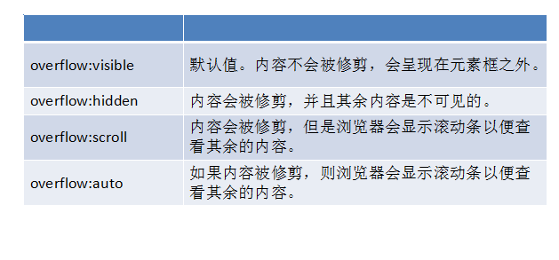

#### 浮动可以左右浮动

loat:  left   |   right
> 元素浮动之后不占据原来的位置（脱标）
> 浮动的盒子在一行上显示
> 行内元素浮动之后转换为行内块元素。

左右
> ４.1浮动的作用
	◆文本绕图
	◆制作导航
	◆网页布局
	
浮动之后，将不会占用原来的位置，所以写设置
清除浮动
◆清除浮动不是不用浮动，清除浮动产生的不利影响。
◆清除浮动的方法
clear: left  |  right  | both
工作里用的最多的是clear:both;

	top的浮动，那么给下面的添加clear：both;
	

处理方法
★额外标签法
 在最后一个浮动元素后添加标签,。
 
 	在两标签之间加上
 		<div style="clear: both;"></div>
 
 
★额外标签法
 在最后一个浮动元素后添加标签,。

★给父集元素使用overflow:hidden;    bfc
  如果有内容出了盒子，不能使用这个方法。
  
  	给父类加上overflow:hidden
	但是这个会将出了盒子的删除掉，所以比较恶心人

★伪元素清除浮动  推荐使用
```
/* 清除浮动 */
.	clearfix::before,
.	clearfix::after{
	content:'';
	display: block;
	line-height: 0;
	height: 0;
	visibility: hidden;
	clear: both;
}
```
上面的这种使用方法是使用在父标签上的，子标签时没有作用的

### overflow




定位方向: left  | right  | top  | bottom
◆position:static;  静态定位。默认值，就是文档流。

◆绝对定位
Position:absolute;
特点：
★元素使用绝对定位之后不占据原来的位置（脱标）
★元素使用绝对定位，位置是从浏览器出发。
★嵌套的盒子，父盒子没有使用定位，子盒子绝对定位，子盒子位置是从浏览器出发。
★嵌套的盒子，父盒子使用定位，子盒子绝对定位，子盒子位置是从父元素位置出发。
★给行内元素使用绝对定位之后，转换为行内块。（不推荐使用，推荐使用display:inline-block;）
◆相对定位
Position: relative;
特点：
★使用相对定位，位置从自身出发。
★还占据原来的位置。
★子绝父相（父元素相对定位，子元素绝对定位）
★行内元素使用相对定位不能转行内块
◆固定定位
Position:fixed;
特点：
★固定定位之后，不占据原来的位置（脱标）
★元素使用固定定位之后，位置从浏览器出发。
★元素使用固定定位之后，会转化为行内块（不推荐，推荐使用display:inline-block;）

	.baby{
		position:absolute;
		width: 100px;
		height: 100px;
		background: orange;
		/*调整元素的层叠顺序*默认值0-999，值越大，元素越在上边/
		z-index: 2;
	}
	.baby1{
		position:absolute;
		width: 100px;
		height: 100px;
		background: red;

	}
	
	
定位方向有四种：上下作用
定方式：静态定位=============》标准流
			
绝对定位
	absolute：可以使用上下作用的范式设置位置，以浏览器上文基准
	如果父类也进行了绝对定位的时候，就父类为基准