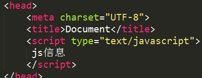
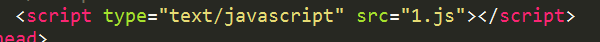

####  Js书写位置

 - 方式一:
	 
 - 方式二：嵌入写法
	 
补充内嵌式写法：  
> 推荐Js代码最好放在body结束标签的后边。
  
 补充外链式写法：
>推荐将多个js文件合并为一个js文件在浏览器中执行。

####  Js初体验
在页面中输出消息的几种写法
> ◆alert(“信息”)   在页面出现一个弹出框，将信息弹出。
◆confirm(“信息”) 在页面出现一个弹出框，将信息显示，常与if判断语句结合使用。
◆prompt(“信息”)  弹出一个文本框，可以在文本框接收内容。常用于接收信息。
◆console.log(“信息”)将信息输出到控制台，常用于代码调试。
◆document.write(“信息”) 直接在页面输出消息。

代码注释
> 快捷键:ctrl+/
◆ 单行注释   //
◆多行注释/*   */

*注意
	一行代码结束后，必须在后边加上分号
	
 ----
```
        alert("我是内嵌式");
        prompt("请输入：");
        confirm("你好吗？");

        //输出语句
        console.log("我是控制台输出");
        console.error("我是错误");//了解
        console.warn("我是警告");//了解

        document.write("<h1>我是h1标签</h1>");//页面输出内容而且识别标签
```
## 数组的定义

> var arr1 = [1,2,3];
> var arr2 = new Array(3);
> var arr3 = new Array(1,2,3);

数组单个加入

> arr2[0]="小";

数组 的长度
> arr.length

#### 函数定义

//定义方法
>function fn(){
	console.log(1);
}

> //函数不调用不执行
//执行方法是：函数名+();
fn();

 1. 有参数的
   >  function fn(a,b){
        alert(a+b);
    }
	
 2. 调用
>    fn(1,1);
		fn(2,2);
		fn(4,4);
 
 如果形参个数与实参个数不匹配...（一般情况下，我们不会让形参和实参不匹配）
 >   1.相等的话，正常执行。
     2.实参大于形参，正常执行。（多余的实参，函数不使用）
   3.实参小于形参，要看你的程序是否报错。（报错，NaN，undefined）
        //未给定实参的形参为undefined;

方法有返回值
```
var aaa = fn();
    console.log(aaa);
    function fn(){
        var bbb = 111;
        //如果我们想把函数内部的值赋值为外部，必须使用return;
        //如果没有return或者只有return没有值，那么返回值都是undefined。
        return bbb;
    }
```

函数的打印
```
  打印函数名，就等于打印整个函数。
   console.log(fn);
   打印执行函数，就等于打印函数的返回值。
    console.log(fn());  //函数中包函数，先执行里面，后执行外面。
```
#### 函数的定义方法

 - 第一种
 ```
    function fn1(){
        console.log("我是第一种定义方法！");
    }
```
 - 第二种(匿名函数)
```
	var fn2 = function (){
        console.log("我是第二种定义方法！");
    }
  ```
 - 第三种
  ```
	var fn3 = new Function("console.log('我是第三种定义方法！')");
```

###### 匿名函数的定义
```
   //调用方法：
    //1.直接调用
    (function (){
        console.log(1);
    })();
```
#### 绑定事件

```
document.onclick = function(){
	alert(1);
}
```

#### 定时器
```
setInterval(functio(){
	console.log(444);
},1000);
```

#### 查看数据类型
```
console.log(typeof str);
```
##### 回调函数
```
    console.log(fn(10,5,test1));
    console.log(fn(10,5,test2));
    console.log(fn(10,5,test3));
    console.log(fn(10,5,test4));


    function fn(num1,num2,demo){
        return demo(num1,num2);
    }

    //定义四个规则：加减乘除
    function test1(a,b){
        return a+b;
    }
    function test2(a,b){
        return a-b;
    }
    function test3(a,b){
        return a*b;
    }
    function test4(a,b){
        return a/b;
    }

```
##### 对象定义
```
var student = new Object();
student.name = "张三";
student.age = 18;
student.address = "辽宁省铁岭市莲花乡池水沟子";
student.sayHi = function () {
      console.log(this.name+"说：大家好！");
}
student.sayHi();
```
定义一个构造函数
```
 //创建一个构造函数
    function Student(name){
        //构造函数中的对象指的是this。
        this.name = name;
        this.sayHi = function () {
            console.log(this.name+"说：大家好！");
        }
    }
```
### 字面量
```
对象的字面量就是一个{};而里面的属性和方法是以：形式对应表现的。（键值对）
    var obj2 = {aaa:obj1,name:"张三","age":18,sayHi: function () {
        console.log(1);
    }};
```
