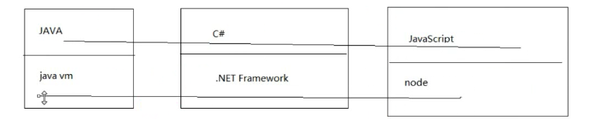
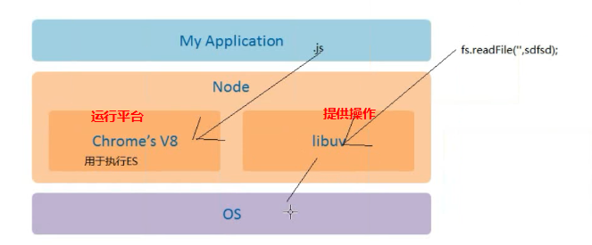

## js是什么？
	+ 脚本语言
	+ 运行在浏览器
	+ 做交互

-- js运行环境
	 + 运行在js引擎中
	 
-- 浏览器的作用
	+ 请求一个url 
	+ 解析服务器返回来的内容，进行渲染 

- js可以做什么?
	+ 对dom的增删改
	+ Ajax
	+ Bom对象{历史记录，页跳转}

- 不可操作文件
	+ 文件的增删改查
	+ 不可操作系统信息

- js操作
    + 他是从服务端获取和数据，在浏览器继续解析
  
- 编程能力取决于
	+ 取决于环境
	+ 语言只是提供了定义变量定义循环

-------------------

## nodejs

- nodejs是是什么
	+ 他是一个平台，可以让js运行在服务器端
	+ nodejs也是js的工具库

高并发的时候使用nodejs进行

### 总结
	nodejs是js是运行平台，他不是一门语言，也不是框架
	
	