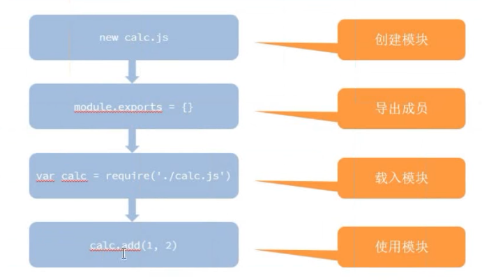

### 模块化，实现计算器功能
```
// 实现命令行计算器
'use strict';
// 1. 接收参数
const args = process.argv.slice(2);//只取后面的参数，不取前两个参数 
// ['node 执行程序所在路径'，'当前脚本所在路径'，....]
// 2. 分析参数
if (args.length !== 3) {
  console.log('参数不合法');
  throw new Error('参数不合法');
  // return false;
}

// P1 OP P2
let parameter1 = args[0];
let operator = args[1];
let parameter2 = args[2];
// 3. 进行运算
// let result = eval(`${parameter1} ${operator} ${parameter2}`);
// console.log(result);
let result;
switch (operator) {
  case '+':
    result = parseFloat(parameter1) + parseFloat(parameter2);
    break;
  case '-':
    result = parseFloat(parameter1) - parseFloat(parameter2);
    break;
  case '*':
  case 'x':
    result = parseFloat(parameter1) * parseFloat(parameter2);
    break;
  case '/':
  case '÷':
    result = parseFloat(parameter1) / parseFloat(parameter2);
    break;
  default:
    throw new Error('不被支持的操作符' + operator);
}
console.log(result);


```
**下来将其拆分出模块**
```
// 实现命令行计算器
'use strict';
const args = process.argv.slice(2);//只取后面的参数，不取前两个参数 
if (args.length !== 3) {
  console.log('参数不合法');
  throw new Error('参数不合法');
  // return false;
}
// P1 OP P2
let parameter1 = args[0];
let operator = args[1];
let parameter2 = args[2];
****************************
var jsq = require(路径)将问价引进来了

let result;
switch (operator) {
  case '+':
    result = jsq.add("参数1，参数2");
    break;
  case '-':
    result = jsq.jian("参数1，参数2");
	break;
  case '*':
  case 'x':
    result = jsq.cheng("参数1，参数2");
    break;
  case '/':
  case '÷':
    result = jsq.chu("参数1，参数2");
    break;
  default:
    throw new Error('不被支持的操作符' + operator);
}
console.log(result);
```
**模块**
```
function convert(input) {
  return parseFloat(input);//将数据转换为数字
}

function add(a, b) {
  return convert(a) + convert(b);
}

function jian(a, b) {
  return convert(a) - convert(b);
}

function cheng(a, b) {
  return convert(a) * convert(b);
}

function chu(a, b) {
  return convert(a) / convert(b);
}
//最后将自己暴露出去
module.exports = { add, subtract, mutiply, divide };
  // module.exports = {
  //   add: add,
  //   subtract: subtract,
  //   mutiply: mutiply,
  //   divide: divide
  // };
```

**模块引入**
- 一般会有三种
	- 自己定义的
	- 系统自带的 
	- 第三方的 


**模块全局环境**
我们在之后文操作中必须使用绝对路径

__dirname:当前文件的所在目录
__filename:当前文件的路径

使用案例
```
const fs = require('fs');
///所以文件操作使用绝对路径
fs.readfie(__dirname+'/../list.md',(erroe,content)=>{
	if(error)
		throw error;
	console.log(content);//读出来的是以二进制
})
```
如想要输出字符串的话，那么就需要使用如下方式
```
fs.readfie(__dirname+'/../list.md','utf-8',(erroe,content)=>{
	if(error)
		throw error;
	console.log(content);//读出来的是以二进制
})
```

```
fs.readfie(__dirname+'/../list.md',(erroe,content)=>{
	if(error)
		throw error;
	console.log(content.toString());//读出来的是以二进制
})
```
**错误优先**

