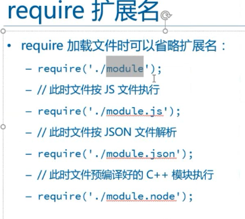

**加载文件**

1.不仅可以载入json，也可载入js文件
  - 顺序js>json>node

2.如果是文件夹，就会加载文件夹下的index
- 如果下面有package.json就会加载这个文件，前提是
```
{
	main:test.js
}
```
test.js文件存在

**如果以./或者是/开头**
*	这个时候不是找文件，而是找系统的模块


**模块require有缓存**
问题一：怎样缓存
	缓存通过cache，并且里面通过路径做缓存
问题二：如何清除缓存
	得到键，让进行遍历，进行往出