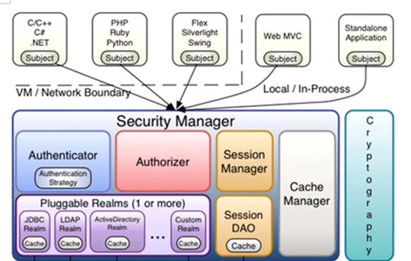
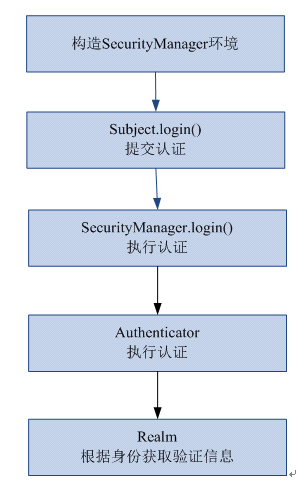
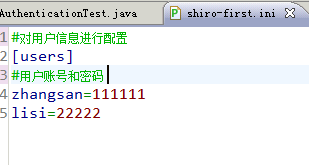
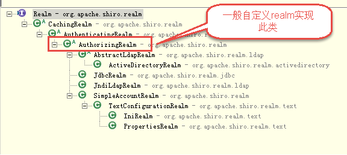
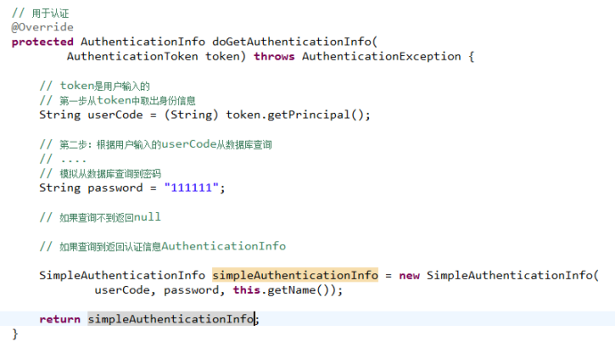
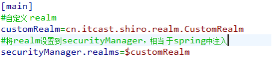
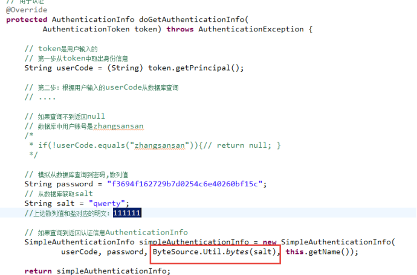
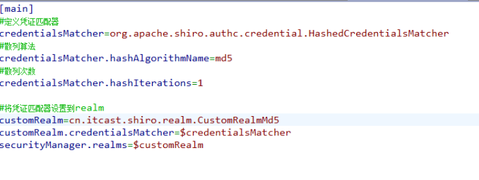
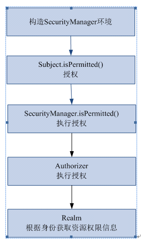

·**权限管理**
1.只要有用户参与的系统一般都要有权限管理，权限管理实现对用户访问系统的控制，按照安全规则或者安全策略控制用户可以访问而且只能访问自己被授权的资源。
	- 权限管理包括用户认证和授权两部分。
**用户认证**
- 概念
	用户认证，用户去访问系统，系统要验证用户身份的合法性。最常用的用户身份验证的方法：1、用户名密码方式、2、指纹打卡机、3、基于证书验证方法。。系统验证用户身份合法，用户方可访问系统的资源。
- 参与的关键对象
	subject：主体
	pricipal：身份信息
	crendential：凭证信息
	**主体在身份认证的时候需要身份信息和凭证**

**用户授权**
	在通过身份验证之后想，需要将有访问资源的权限才可以进行访问
	
	身份验证之后，需要对这个身份进行授权，它也只能访问自己拥有权限的资源。
	
- 谁给什么有什么样的权限
	张三对员信息有增加的权限。
	
**权限模型**
- 主体：
- 角色
- 拥有什么样的权限
- 对什么资源

一个主题有多个角色，角色有多个权限，这个权限有多个资源的访问

**分配权限**
- 用户需要分配相应的权限才可访问相应的资源。权限是对于资源的操作许可。
通常给用户分配资源权限需要将权限信息持久化，比如存储在关系数据库中。
把用户信息、权限管理、用户分配的权限信息写到数据库（权限数据模型）


**授权方式**
- 基于资源的权限访问控制
- 基于角色的权限访问控制

基于角色的访问控制，比如班长可以发布作业、请假处理，只有具备了这个角色之后才可以访问

举例：
前提：有一个资源，需要具备班长的权限，这个时候就需要在资源上加一个注解，这个注解的上面写一个注解，但是有一天学习委员也具备这种权限，那就不得不加上学习委员这样的角色，这是很不利于维护的，那么需要通过另一种方基于资源的访问控制。


基于资源访问控制，加入请假，那就在请假上面加上请假权限的这种注解，加入有一天班干部都可以进行请假处理，只需要给班干部一个这样的权限就可以了。方便维护。

**权限管理的解决方案**
粗粒度和细粒度的权限

区分：细粒度可以在数据上进行操作
粗粒度和细粒度例子：
 系统有一个用户列表查询页面，对用户列表查询分权限，如果粗颗粒管理，张三和李四都有用户列表查询的权限，张三和李四都可以访问用户列表查询。
进一步进行细颗粒管理，张三（行政部）和李四(开发部)只可以查询自己本部门的用户信息。张三只能查看行政部 的用户信息，李四只能查看开发部门的用户信息。细粒度权限管理就是数据级别的权限管理。

 粗粒度可以使用拦截器进行操作实现
 细粒度的可以使用service来实现。
 
 **基于url的权限控制**
 这个通过拦截就可以容易实现，将资源的url放入数据，每次比较，他是否有这个url。
 
 - 说点其他的
	 一般在登录使用用户名和密码之后，使用定向的方式，去另一个地址上。 
	 
- 拦截器实现的步骤
	- 首先获取请求的url
	- 查询出公共的url
		- 如果是，那就返回true[放行]
		- 不是那就继续判断
	- 验证身份，比如说登录
		- 没有身份，那就去登录页面


- 获取用户的访问权限
	- 根据用户，从数据库中查询相应的权限和资源，将权限放入到session中
	- 在拦截器中进行判断

-----------

### shiro



subject：主体，可以是用户也可以是程序，主体要访问系统，系统需要对主体进行认证、授权。
securityManager：安全管理器，主体进行认证和授权都 是通过securityManager进行。
authenticator：认证器，主体进行认证最终通过authenticator进行的。
authorizer：授权器，主体进行授权最终通过authorizer进行的。
sessionManager：web应用中一般是用web容器对session进行管理，shiro也提供一套session管理的方式。
SessionDao：  通过SessionDao管理session数据，针对个性化的session数据存储需要使用sessionDao。
cache Manager：缓存管理器，主要对session和授权数据进行缓存，比如将授权数据通过cacheManager进行缓存管理，和ehcache整合对缓存数据进行管理。
realm：域，领域，相当于数据源，通过realm存取认证、授权相关数据。
注意：在realm中存储授权和认证的逻辑。
cryptography：密码管理，提供了一套加密/解密的组件，方便开发。比如提供常用的散列、加/解密等功能。
比如 md5散列算法。
**shiro先睹为快**
简单demo
- 导入jar文件
- 认证的流程
	
- 创建一个  xx.ini文件，创建一个secrityManager工厂
	
- 创建securityManager工厂，通过ini配置文件创建securityManager工厂    Factory<SecurityManager> factory = new IniSecurityManagerFactory(
				"classpath:shiro-first.ini");
- 创建SecurityManager
  SecurityManager securityManager = factory.getInstance();
- 将securityManager设置当前的运行环境中
  SecurityUtils.setSecurityManager(securityManager);
- 从SecurityUtils里边创建一个subject
  Subject subject = SecurityUtils.getSubject();
- //在认证提交前准备token（令牌）
	UsernamePasswordToken token = new UsernamePasswordToken("zhangsan", "111111");
		try {
			//执行认证提交
			subject.login(token);
		} catch (AuthenticationException e) {
			// TODO Auto-generated catch block
			e.printStackTrace();
		}
		
		//是否认证通过
		boolean isAuthenticated =  subject.isAuthenticated();
		
		System.out.println("是否认证通过：" + isAuthenticated);
		
		//退出操作
		subject.logout();
		
		//是否认证通过
		isAuthenticated =  subject.isAuthenticated();
		
		System.out.println("是否认证通过：" + isAuthenticated);
		
		

	}

**操作步骤**
1、通过ini配置文件创建securityManager
2、调用subject.login方法主体提交认证，提交的token
3、securityManager进行认证，securityManager最终由ModularRealmAuthenticator进行认证。
4、ModularRealmAuthenticator调用IniRealm(给realm传入token) 去ini配置文件中查询用户信息
5、IniRealm根据输入的token（UsernamePasswordToken）从 shiro-first.ini查询用户信息，根据账号查询用户信息（账号和密码）
	如果查询到用户信息，就给ModularRealmAuthenticator返回用户信息（账号和密码）
	如果查询不到，就给ModularRealmAuthenticator返回null
6、ModularRealmAuthenticator接收IniRealm返回Authentication认证信息
	如果返回的认证信息是null，ModularRealmAuthenticator抛出异常（org.apache.shiro.authc.UnknownAccountException）

	如果返回的认证信息不是null（说明inirealm找到了用户），对IniRealm返回用户密码 （在ini文件中存在）和 token中的密码 进行对比，如果不一致抛出异常（org.apache.shiro.authc.IncorrectCredentialsException）
	

-------
ModularRealmAuthenticator作用进行认证，需要调用realm查询用户信息（在数据库中存在用户信息）
ModularRealmAuthenticator进行密码对比（认证过程）。

realm：需要根据token中的身份信息去查询数据库（入门程序使用ini配置文件），如果查到用户返回认证信息，如果查询不到返回null。


----
上面的用户名和密码来资源配置文件，以后肯定来自于数据库的查询结果
**自定义realm**


下载需要配置

代码获取
同上边的入门程序，需要更改ini配置文件路径：
Factory<SecurityManager> factory = new IniSecurityManagerFactory(
				"classpath:shiro-realm.ini");
- 加盐之后




**授权**

- Shiro 支持三种方式的授权：
	- 编程式：通过写if/else 授权代码块完成
```
Subject subject = SecurityUtils.getSubject();
if(subject.hasRole(“admin”)) {
//有权限
} else {
//无权限
}
```
- 注解式：通过在执行的Java方法上放置相应的注解完成：
```
@RequiresRoles("admin")
public void hello() {
//有权限
}
```
- JSP/GSP 标签：在JSP/GSP 页面通过相应的标签完成：
```
<shiro:hasRole name="admin">
<!— 有权限—>
</shiro:hasRole>
```
**shiro-permission.ini**
shiro-permission.ini里边的内容相当于在数据库。

```
#用户
[users]
#用户zhang的密码是123，此用户具有role1和role2两个角色
zhang=123,role1,role2
wang=123,role2

#权限
[roles]
#角色role1对资源user拥有create、update权限
role1=user:create,user:update
#角色role2对资源user拥有create、delete权限
role2=user:create,user:delete
#角色role3对资源user拥有create权限
role3=user:create


权限标识符号规则：资源:操作:实例(中间使用半角:分隔)
user：create:01  表示对用户资源的01实例进行create操作。
user:create：表示对用户资源进行create操作，相当于user:create:*，对所有用户资源实例进行create操作。

user：*：01  表示对用户资源实例01进行所有操作。
```