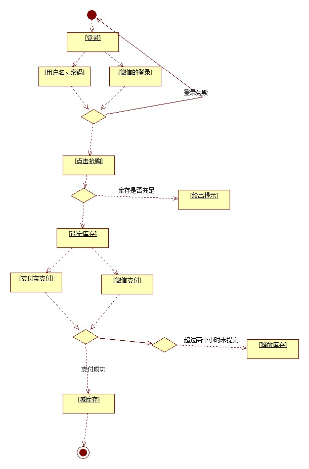

**任务一：秒杀业务场景**
- 秒杀：就是一种竞争性的购买操作，流程图如下
 
- 出现的三个问题
	- 高并发
	- 单个用户多次抢购
**任务二：架构设计**

- 1.2.2 应用架构设计
   用户业务：用户登录、用户注销、用户权限、用户修改密码等
   商品业务：商品查询、商品库存判断、商品抢购等
   订单业务：生成订单、查询订单、取消订单、支付订单等
   支付业务：支付宝支付、微信支付、支付成功/支付失败处理等
  
  **高并发的解决方案**
  - 高并发问题采样消息队列，降低服务器压力。
  - 保证一次请求成功，可以使用幂等性解决，多次请求只有一次访问成功，使用Redis分布式锁和Redis保存机制来记录用户的操作状态。
  - 抢购顺序：采样消息队列的消息排队机制来完成抢购自动排队
  
 **部署架构设计**
 使用docker实现分布式集群对项目进行部署

